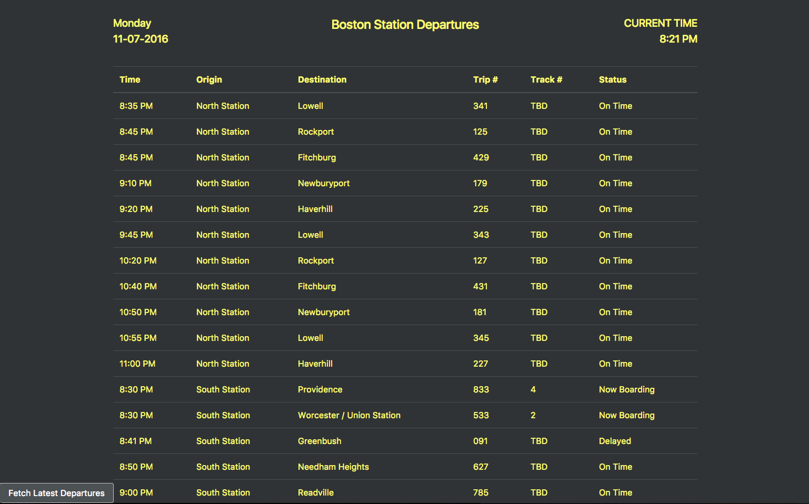
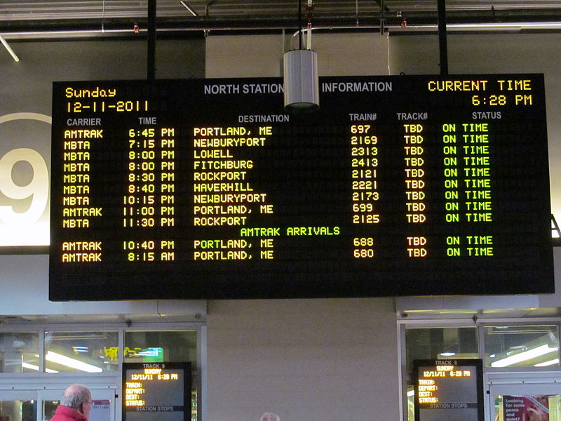

## MBTA Departures

A simple app which fetches and parses upcoming MBTA train departures. The data
source is pulled from the developer portal for the MBTA.

See [the Demo App](https://departures-mbta.herokuapp.com/) hosted on [Heroku](https://www.heroku.com/).

### Purpose

This app is build as a demonstration of CSV parsing backed by good OOD. It is simple,
however, the principles demonstrate a solid understanding of OOD concepts and relational data. It additionally highlights outstanding test coverage on both unit and end-to-end levels.

The app is built to model a display board found in a real station such as North Staion, shown below.

